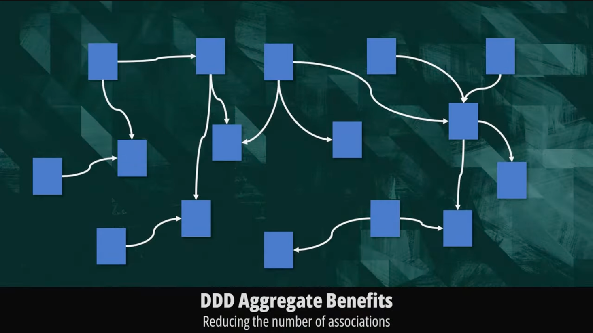

# Domain-Driven Design in Node.js

**Author:** Heorhii Huziuk ‹[huziukwork@gmail.com](mailto:huziukwork@gmail.com)›
*Node.js Developer (Software Engineer / Backend Developer at FarmFusion)*

> **Prerequisites:**
> The creation of this article was prompted by the lack of coverage on the topic of domain-driven design in Node.js. There are many individual approaches that are unpopular: each author brings something of their own, and often they contradict each other. Although there is a general concept of DDD, not all of its practices are necessary for development specifically in Node.js conditions; the situation is similar to the `Gang Of Four` patterns, whose description is only tangentially related to the JavaScript development world. I wish you pleasant reading and sincerely invite you to edit or discussionn :)

---

### Table of Contents

1.  [**Domain**](#domain)
    *   1.1 [Entities](#entities)
    *   1.2 [Value Objects](#value-objects)
    *   1.3 [Aggregates](#aggregates)
    *   1.4 [Factories](#factories)
2.  [**Application**](#application)
    *   2.1 [Services](#services)
    *   2.2 [Application DTOs](#application-dtos)
    *   2.3 [Structure (Application)](#structure-application)
3.  [**Infrastructure**](#infrastructure)
    *   3.1 [Database](#database)
        *   3.1.1 [Mappers](#mappers)
    *   3.2 [Repositories (Interfaces)](#repositories-interfaces)
    *   3.3 [Repositories (Implementations)](#repositories-implementations)
    *   3.4 [Structure (Infrastructure)](#structure-infrastructure)
4.  [**Presentation**](#presentation)
    *   4.1 [Controllers / Routes](#controllers--routes)
    *   4.2 [DTOs (Presentation)](#dtos-presentation)
    *   4.3 [Structure (Presentation)](#structure-presentation)
5.  [**Summary**](#summary)
6.  [**References**](#references)

---

### Domain
> The Domain layer is responsible for business logic. What is business logic? - It's a set of rules by which the application operates: list of fields, validation rules, etc.

#### Entities
> Entities describe the fields and objects of the application. Objects in the sense: we have a user - we need to create an entity for them, there is a Tariff - we need to create an entity for it. An entity is like a table in a database; it has a specific set of fields: basic ones are ID, name, surname, enum with roles, when the record was created, and so on.

Important to notice:
 * An entity should encapsulate behavior or invariants (private not public).
 * An entity does not check state, does not check email format or phone validity.
 * An entity should contain value-objects if we have complex data: phone, email, time...


Here is an example of how to implement an entity for a user:
```ts
import { Email } from '../value-objects/Email'; // VO is used here, it will be discussed in the next section

export class User {
    private readonly id: string;
    private name: string;
    private email: Email;
    private isActive: boolean;

    constructor(id: string, name: string, email: Email, isActive: boolean){
      this.id = id;
      this.name = name;
      this.email = email;
      this.isActive = isActive;
    }

    getEmail(): Email {
      return this.email;
    }

    changeEmail(newEmail: Email): void {
      this.email = newEmail;
    }

    activate(): void {
      this.isActive = true;
    }

    deactivate() {
      this.isActive = false;
    }

    getName(): string{
      return this.name;
    }

    toJson() {
      return {
        id: this.id,
        name: this.name,
        email: this.email.getValue(),
      }
  }
}
```

here is an example of use in an application service:
```ts
function registerUser(name: string, rawEmail: string): User {
  const email = new Email(rawEmail); // Value Object: encapsulates validation
  const user = new User(uuidv4(), name, email, false);
  return user;
}

// let's imagine this came from the server: 'Olena', 'olena@example.com'
const user = registerUser('Olena', 'olena@example.com');
```

#### Value-Objects

> The next part of the domain layer is Value Objects - these are actually the part that implements access to more complex fields: Password, Email, PhoneNumber, where we need to perform certain checks or validation against our defined business rules.

Key properties that define the distinction of Value Objects:
 * encapsulates value
 * guarantees their validity according to business rules
 * has no identity (unlike Entity)
 * compared by value, not by identifier

```ts
// email.vo.ts
export class Email {
  private readonly value: string;

  constructor(value: string) {
    if (!/^[^\s@]+@[^\s@]+\.[^\s@]+$/.test(value)) {
      throw new Error('Invalid email');
    }
    this.value = value;
  }

  getValue(): string {
    return this.value;
  }
}
```

```ts
// password.vo.ts
import * as bcrypt from 'bcrypt';

export class Password {
  private readonly hashed: string;

  private constructor(hashed: string) {
    this.hashed = hashed;
  }

  static async create(raw: string): Promise<Password> {
    if (raw.length < 8) throw new Error('Password too short');
    const hashed = await bcrypt.hash(raw, 10);
    return new Password(hashed);
  }

  static fromHashed(hashed: string): Password {
    return new Password(hashed);
  }

  async compare(raw: string): Promise<boolean> {
    return bcrypt.compare(raw, this.hashed);
  }

  getHashed(): string {
    return this.hashed;
  }
}
```

Example of use in Entity:

```ts
import { Email } from '../value-objects/email.vo';
import { Password } from '../value-objects/password.vo';

export class User {
  constructor(
    private readonly id: string,
    private name: string,
    private surname: string,
    private email: Email,
    private phone: string | null,
    private password: Password,
    private isActive: boolean,
    private readonly createdAt: Date,
  ) {}

  getId(): string { return this.id; }
  getEmail(): string { return this.email.getValue(); }
  getHashedPassword(): string { return this.password.getHashed(); }

  activate() { this.isActive = true; }
  deactivate() { this.isActive = false; }

  async comparePassword(raw: string): Promise<boolean> {
    return this.password.compare(raw);
  }

  toPrimitives() {
    return {
      id: this.id,
      name: this.name,
      surname: this.surname,
      email: this.email.getValue(),
      phone: this.phone,
      password: this.password.getHashed(),
      isActive: this.isActive,
      createdAt: this.createdAt
    };
  }
}
```

Here is another example of use:

```ts
// money.vo.ts
export class Money {
  private readonly amount: number;
  private readonly currency: string;

  constructor(amount: number, currency: string) {
    if (amount < 0) throw new Error('Amount cannot be negative');

    const allowedCurrencies = ['USD', 'EUR', 'UAH'];
    if (!allowedCurrencies.includes(currency)) {
      throw new Error(`Unsupported currency: ${currency}`);
    }

    this.amount = amount;
    this.currency = currency;
  }

  getAmount(): number {
    return this.amount;
  }

  getCurrency(): string {
    return this.currency;
  }

  add(other: Money): Money {
    if (this.currency !== other.currency) throw new Error('Currency mismatch');
    return new Money(this.amount + other.amount, this.currency);
  }

  subtract(other: Money): Money {
    if (this.currency !== other.currency) throw new Error('Currency mismatch');
    const result = this.amount - other.amount;
    if (result < 0) throw new Error('Resulting amount cannot be negative');
    return new Money(result, this.currency);
  }

  equals(other: Money): boolean {
    return this.amount === other.amount && this.currency === other.currency;
  }

  toString(): string {
    return `${this.amount.toFixed(2)} ${this.currency}`;
  }
}
```

And an example of use in a domain entity and repository:

Entity:
```ts
// src/domain/entities/invoice.entity.ts
import { Money } from '../value-objects/money.vo';
import { v4 as uuidv4 } from 'uuid';

export class Invoice {
  private readonly id: string;
  private readonly customerId: string;
  private total: Money;
  private isPaid: boolean = false;

  constructor(customerId: string, total: Money, id?: string) {
    this.id = id ?? uuidv4();
    this.customerId = customerId;
    this.total = total;
  }

  getId(): string {
    return this.id;
  }

  getTotal(): Money {
    return this.total;
  }

  markAsPaid(): void {
    this.isPaid = true;
  }

  applyDiscount(discount: Money): void {
    this.total = this.total.subtract(discount);
  }

  toJSON() {
    return {
      id: this.id,
      customerId: this.customerId,
      total: this.total.toString(),
      isPaid: this.isPaid,
    };
  }
}
```

A small ORM entity:
```ts
// src/infrastructure/database/invoice.orm-entity.ts
export class InvoiceOrmEntity {
  id: string;
  customerId: string;
  amount: number;
  currency: string;
  isPaid: boolean;
}
```

And here is the repository itself:
```ts
// src/infrastructure/repositories/invoice.repository.ts
import { InvoiceOrmEntity } from '../database/invoice.orm-entity';
import { Invoice } from '../../domain/entities/invoice.entity';
import { Money } from '../../domain/value-objects/money.vo';

export class InvoiceRepository {
  private db: InvoiceOrmEntity[] = []; // conditional DB in memory

  async save(invoice: Invoice): Promise<void> {
    const record: InvoiceOrmEntity = {
      id: invoice.getId(),
      customerId: invoice['customerId'],
      amount: invoice.getTotal().getAmount(),
      currency: invoice.getTotal().getCurrency(),
      isPaid: invoice['isPaid'],
    };
    this.db.push(record);
  }

  async findById(id: string): Promise<Invoice | null> {
    const found = this.db.find(i => i.id === id);
    if (!found) return null;

    return new Invoice(
      found.customerId,
      new Money(found.amount, found.currency),
      found.id,
    );
  }
}
```

Service:
```ts
// src/application/invoice.service.ts
import { Money } from '../domain/value-objects/money.vo';
import { Invoice } from '../domain/entities/invoice.entity';
import { InvoiceRepository } from '../infrastructure/repositories/invoice.repository';

export class InvoiceService {
  constructor(private readonly repo: InvoiceRepository) {}

  async createInvoice(customerId: string, rawAmount: number, currency: string): Promise<Invoice> {
    const total = new Money(rawAmount, currency);
    const invoice = new Invoice(customerId, total);
    await this.repo.save(invoice);
    return invoice;
  }

  async applyDiscount(invoiceId: string, discountValue: number): Promise<Invoice> {
    const invoice = await this.repo.findById(invoiceId);
    if (!invoice) throw new Error('Invoice not found');

    const discount = new Money(discountValue, invoice.getTotal().getCurrency());
    invoice.applyDiscount(discount);
    await this.repo.save(invoice);
    return invoice;
  }
}
```

#### Aggregates
> Aggregates are a collection of interconnected objects that are treated by the system as a single unit for the purposes of updating and saving.

##### **Basic Concepts**
1. **Aggregate Root**
    - is the single "entry point" for interacting with the aggregate.
    - ensures the consistency of all objects in the aggregate.
    - only the aggregate root is stored in the repository, and internal objects are changed through the root's methods.
2. **Bounded Context**
    - aggregates live within a specific context.
    - in one context, the root of one aggregate does not access the internal objects of another — interaction is through identifiers or domain events.
3. **Aggregate Invariants**
    - rules and conditions that must always hold true for the state within the aggregate.

Here is a diagram showing an example of interaction between two aggregates:


*Schema 1: Aggregate interaction diagram. Source: [Domain-Driven Aggregates Explained | Why you should use them](https://youtu.be/SvnsOX4oVVo?si=fOr35OPCDUUFNWQn)*

##### **Why are aggregates needed?**
* **Consistency:** ensure that all parts of the aggregate are always in a correct state after any operation.
* **Transactional boundary:** all changes in an aggregate are committed as a single transaction.
* **Isolation:** protect the internal structure (encapsulation), allowing access only through the root.
* **Model clarity:** clusters of objects are logically grouped into a single whole by business context.

Here is a diagram that clearly shows the web of relations we get without creating aggregates:


*Schema 2: Absence of aggregates in code. Source: [Domain-Driven Aggregates Explained | Why you should use them](https://youtu.be/SvnsOX4oVVo?si=fOr35OPCDUUFNWQn)*

Here is a diagram demonstrating the clarity that using aggregates gives us:


*Schema 3: Code separated into aggregates. Source: [Domain-Driven Aggregates Explained | Why you should use them](https://youtu.be/SvnsOX4oVVo?si=fOr35OPCDUUFNWQn)*

##### **Using aggregates in code**

Example of a `Product` aggregate, where we implement `Stock` as an entity, and Price as a `Value Object`:

```ts
// Value Object: Price
export class Price {
  private readonly _amount: number;
  private readonly _currency: string;

  constructor(amount: number, currency: string) {
    if (amount < 0) {
      throw new Error("Amount cannot be a negative number");
    }
    if (!currency || currency.trim().length !== 3) {
      throw new Error("Currency must be a valid 3-letter code");
    }
    this._amount = amount;
    this._currency = currency.toUpperCase();
  }

  get amount(): number {
    return this._amount;
  }

  get currency(): string {
    return this._currency;
  }

  toString(): string {
    return `${this._amount} ${this._currency}`;
  }
}

// Value Object: Location
export class Location {
  private readonly _longitude: number;
  private readonly _latitude: number;

  constructor(longitude: number, latitude: number) {
    if (longitude < -180 || longitude > 180) {
      throw new Error("Longitude must be between -180 and 180");
    }
    if (latitude < -90 || latitude > 90) {
      throw new Error("Latitude must be between -90 and 90");
    }
    this._longitude = longitude;
    this._latitude = latitude;
  }

  get longitude(): number {
    return this._longitude;
  }

  get latitude(): number {
    return this._latitude;
  }

  toString(): string {
    return `(${this._latitude}, ${this._longitude})`;
  }
}

// Entity: Stock (part of the Product aggregate)
export class Stock {
  private _location: Location;
  private _quantity: number;

  constructor(location: Location, quantity: number) {
    if (quantity < 0) {
      throw new Error("Quantity cannot be negative");
    }
    this._location = location;
    this._quantity = quantity;
  }

  get location(): Location {
    return this._location;
  }

  get quantity(): number {
    return this._quantity;
  }

  increase(amount: number): void {
    if (amount <= 0) {
      throw new Error("Increase amount must be positive");
    }
    this._quantity += amount;
  }

  decrease(amount: number): void {
    if (amount <= 0 || amount > this._quantity) {
      throw new Error("Invalid decrease amount");
    }
    this._quantity -= amount;
  }
}

// Aggregate Root: Product
export class Product {
  private readonly _id: string;
  private readonly _price: Price;
  private readonly _weight: number;
  private readonly _stocks: Stock[];

  constructor(id: string, price: Price, weight: number, stocks: Stock[]) {
    if (!id || id.trim() === "") {
      throw new Error("Product id must be provided");
    }
    if (weight <= 0) {
      throw new Error("Weight must be a positive number");
    }
    if (!stocks || stocks.length === 0) {
      throw new Error("At least one stock location is required");
    }

    this._id = id;
    this._price = price;
    this._weight = weight;
    this._stocks = stocks;
  }

  get id(): string {
    return this._id;
  }

  get price(): Price {
    return this._price;
  }

  get weight(): number {
    return this._weight;
  }

  get stocks(): ReadonlyArray<Stock> {
    return this._stocks;
  }

  totalQuantity(): number {
    return this._stocks.reduce((sum, s) => sum + s.quantity, 0);
  }

  findStockByLocation(loc: Location): Stock | undefined {
    return this._stocks.find(
      s =>
        s.location.latitude === loc.latitude &&
        s.location.longitude === loc.longitude
    );
  }

  addStock(location: Location, quantity: number): void {
    if (this.findStockByLocation(location)) {
      throw new Error("Stock already exists for this location");
    }
    if (quantity < 0) {
      throw new Error("Quantity cannot be negative");
    }
    this._stocks.push(new Stock(location, quantity));
  }

  transferStock(from: Location, to: Location, quantity: number): void {
    const src = this.findStockByLocation(from);
    const dst = this.findStockByLocation(to);

    if (!src) throw new Error("Source location not found");
    if (!dst) throw new Error("Destination location not found");

    src.decrease(quantity);
    dst.increase(quantity);
  }
}
```

And here is an example implementation of the `Order` aggregate:
```ts
import { Product } from "./Product"; 

// Entity inside Order aggregate: OrderLineItem
export class OrderLineItem {
  private readonly _product: Product;
  private _quantity: number;

  constructor(product: Product, quantity: number) {
    if (quantity <= 0) {
      throw new Error("Quantity must be greater than zero");
    }
    this._product = product;
    this._quantity = quantity;
    this.ensureWeightLimit();
  } 

  get product(): Product {
    return this._product;
  }

  get quantity(): number {
    return this._quantity;
  }

  get weight(): number {
    return this._product.weight * this._quantity;
  }
  
  changeQuantity(newQuantity: number): void {
    if (newQuantity <= 0) {
      throw new Error("Quantity must be greater than zero");
    }
    this._quantity = newQuantity;
    this.ensureWeightLimit();
  }

  private ensureWeightLimit(): void {
    if (this.weight > 100) {
      throw new Error(
        `OrderLineItem weight (${this.weight}kg) exceeds 100kg limit`
      );
    }
  }
}

// Aggregate Root: Order
export class Order {
  private readonly _id: string;
  private readonly _lineItems: OrderLineItem[] = [];

  constructor(id: string, lineItems: OrderLineItem[] = []) {
    if (!id || id.trim() === "") {
      throw new Error("Order id must be provided");
    }
    this._id = id;
    lineItems.forEach((li) => this.addLineItem(li));
    this.ensureTotalWeightLimit();
  }

  get id(): string {
    return this._id;
  }

  get lineItems(): ReadonlyArray<OrderLineItem> {
    return this._lineItems;
  }

  get totalWeight(): number {
    return this._lineItems.reduce((sum, li) => sum + li.weight, 0);
  }

  addLineItem(item: OrderLineItem): void {
    if (this._lineItems.some((li) => li.product.id === item.product.id)) {
      throw new Error("Order already contains this product");
    }
    this._lineItems.push(item);
    this.ensureTotalWeightLimit();
  }

  removeLineItemByProductId(productId: string): void {
    const idx = this._lineItems.findIndex((li) => li.product.id === productId);
    if (idx === -1) {
      throw new Error("LineItem not found for productId " + productId);
    }
    this._lineItems.splice(idx, 1);
  }

  changeLineItemQuantity(productId: string, newQuantity: number): void {
    const li = this._lineItems.find((li) => li.product.id === productId);
    if (!li) {
      throw new Error("LineItem not found for productId " + productId);
    }
    li.changeQuantity(newQuantity);
    this.ensureTotalWeightLimit();
  }

  private ensureTotalWeightLimit(): void {
    if (this.totalWeight > 100) {
      throw new Error(
        `Order total weight (${this.totalWeight}kg) exceeds 100kg limit`
      );
    }
  }
}
```

#### Factories
> In DDD, factories are also distinguished - specialized objects or methods responsible for creating complex domain objects in a correct, consistent state. The main idea is to move all the 'heavy' logic of assembling and validating internal invariants out of the constructor into a separate class or method, rather than bloating the entities themselves.

Two approaches are used to implement a factory:

1. **Static factory method**

Method inside the aggregate/entity itself:

```ts
export class Order {
  private constructor(/* ... */) { /* ... */ }

  public static createNew(
    customerId: string,
    items: OrderLineItem[],
  ): Order {
    // here checks, validation, setting defaults
    if (items.length === 0) {
      throw new Error("Order must have at least one item");
    }
    const order = new Order(/* … */);
    return order;
  }
}

// Call:
const order = Order.createNew(customerId, items);
```

2. **Dedicated factory class**

Separate factory service:

```ts
export class OrderFactory {
  constructor(
    private readonly productRepo: ProductRepository,
    private readonly stockRepo: StockRepository
  ) {}

  public async createOrder(
    customerId: string,
    dtoItems: { productId: string; qty: number }[]
  ): Promise<Order> {
    // load products, check stock, form OrderLineItem…
    const items: OrderLineItem[] = [];
    for (const dto of dtoItems) {
      const product = await this.productRepo.getById(dto.productId);
      items.push(new OrderLineItem(product, dto.qty));
    }
    return Order.createNew(customerId, items);
  }
}

// Call from a service or controller:
const order = await orderFactory.createOrder(userId, payload.items);
```

##### When to use
* When the aggregate/entity constructor ceases to be 'thin' and accumulates a lot of validation code.
* When external services or repositories need to be injected during creation.
* When you want to clearly separate responsibilities: factory for creation, aggregate for business logic after creation.


---

### **Application**
> This layer is designed to implement use cases, specifically for orchestrating the interaction of business logic from the Domain (Entities, Value Objects, Aggregates) with the external world (user interface, API, infrastructure, etc.).

#### **Services**
Application Services are services that:
    * do not contain business logic
    * call domain objects, aggregates, repositories
    * manage transactions, if necessary
    * implement use cases - executing a business scenario, for example, user registration or finding a user by id, without implementing business logic, but only by calling domain objects that implement this logic

**Service example:**
```ts
// application/services/register-user.service.ts
export class RegisterUserService {
  constructor(
    private readonly userRepo: IUserRepository,
    private readonly logger: ILogger,
  ) {}

  async execute(request: RegisterUserRequest): Promise<RegisterUserResponse> {
    this.logger.log(`Registering user: ${request.email}`, 'RegisterUserService');

    const email = new Email(request.email); // VO
    const user = new User(uuidv4(), request.name, email, false); // Entity

    await this.userRepo.save(user);

    this.logger.log(`User registered: ${user.getEmail().getValue()}`, 'RegisterUserService');

    return new RegisterUserResponse(user.getId(), user.getEmail().getValue());
  }
}
```


#### **Application DTOs**
Data Transfer Objects:
 * describe input and output data for services
 * adapt data to/from the domain
 * are used for isolation from external models (ORM entities or HTTP requests)

**DTO example:**
```ts
// dto/register-user.request.ts
export class RegisterUserRequest {
  constructor(public name: string, public email: string) {}
}

// dto/register-user.response.ts
export class RegisterUserResponse {
  constructor(public id: string, public email: string) {}
}
```

The interaction of `RegisterUserService` in the controller will look something like this:
```ts
@Post('/register')
async register(@Body() body: RegisterUserDto) { // our first DTO
  const req = new RegisterUserRequest(body.name, body.email);
  const res = await this.registerUserService.execute(req);
  return res;
}
```

#### **Structure (Application)**
Here is an example of the application structure for the Application layer:
```text
src/
├── application/
│   ├── services/
│   │   └── register-user.service.ts
│   ├── dto/
│   │   ├── register-user.request.ts
│   │   └── register-user.response.ts
```

---

### **Infrastructure**
> This is the layer that aggregates all work with third-party parts, such as: databases, third-party APIs, file system, caching, queues, etc.


#### **Database**
> Here is the part of the code responsible for integrating the database connection. To implement such


##### **Mappers** 

> Mappers are a technical bridge between Infrastructure <—> Domain <—> DTO; they help us not to mix code and not to violate the `Single Responsibility Principle`. The main reason for using mappers is that the domain model and the ORM entity (or DTO) can have different structures, responsibilities, or levels of abstraction. The mapper is responsible for clean and controlled transformation between these layers, maintaining architectural purity and domain isolation from technical details. For example, in the domain model, Email is a Value Object with validation, while in the database it's a regular string — the mapper encapsulates the transformation logic between them.

**Example of a classic mapper:**

```ts
// user.mapper.ts
import { User } from '../../domain/entities/user.entity';
import { Email } from '../../domain/value-objects/email.vo';
import { Password } from '../../domain/value-objects/password.vo';
import { UserOrmEntity } from '../database/user.orm-entity';

export class UserMapper {
  static async toDomain(entity: UserOrmEntity): Promise<User> {
    return new User(
      entity.userId,
      entity.name,
      entity.surname,
      new Email(entity.email),
      entity.phone,
      Password.fromHashed(entity.password),
      entity.isActive,
      entity.createdAt,
    );
  }

  static toOrm(user: User): UserOrmEntity {
    const raw = user.toPrimitives();
    const orm = new UserOrmEntity();
    orm.userId = raw.id;
    orm.name = raw.name;
    orm.surname = raw.surname;
    orm.email = raw.email;
    orm.phone = raw.phone;
    orm.password = raw.password;
    orm.isActive = raw.isActive;
    orm.createdAt = raw.createdAt;
    return orm;
  }
}
```

#### **Repositories (Interfaces)**
> In `infrastructure` we can describe interfaces that we can later implement.

Here is a small example that we will later implement in `Infrastructure`:

```ts
// domain/repositories/user.repository.interface.ts
import { User } from "../../domain/entities/user.entity";

export const USER_REPOSITORY = "USER_REPOSITORY";

export interface IUserRepository {
  create(user: User): Promise<User>;
  findById(userId: string): Promise<User | null>;
  findByEmail(email: string): Promise<User | null>;
  findAll(): Promise<User[]>;
  update(userId: string, user: Partial<User>): Promise<User>;
  delete(userId: string): Promise<void>;
}

```

#### **Repositories (Implementations)**
> In this part, repositories defined in the domain are implemented; of course, this is not strict, but it is often done this way.

```ts
// user.repository.ts
import { Injectable } from '@nestjs/common';
import { Repository } from 'typeorm';
import { InjectRepository } from '@nestjs/typeorm';
import { IUserRepository } from './user.repository.interface';
import { User } from '../../domain/entities/user.entity';
import { UserOrmEntity } from '../database/user.orm-entity';
import { UserMapper } from './user.mapper';

@Injectable()
export class UserRepository implements IUserRepository {
  constructor(
    @InjectRepository(UserOrmEntity)
    private readonly repository: Repository<UserOrmEntity>
  ) {}

  async create(user: User): Promise<User> {
    const saved = await this.repository.save(UserMapper.toOrm(user));
    return await UserMapper.toDomain(saved);
  }

  async findById(userId: string): Promise<User | null> {
    const entity = await this.repository.findOne({ where: { userId } });
    return entity ? await UserMapper.toDomain(entity) : null;
  }

  async findByEmail(email: string): Promise<User | null> {
    const entity = await this.repository.findOne({ where: { email } });
    return entity ? await UserMapper.toDomain(entity) : null;
  }

  async delete(userId: string): Promise<void> {
    await this.repository.delete({ userId });
  }

  async update(user: User): Promise<User> {
    const updated = await this.repository.save(UserMapper.toOrm(user));
    return await UserMapper.toDomain(updated);
  }
}
```

#### **Structure (Infrastructure)**
```text
src/
└── infrastructure/
    ├── config/
    │   ├── database.config.ts        # database connection settings
    │   ├── cache.config.ts           # cache settings (Redis)
    │   └── logger.config.ts          # logging settings (winston/pino)
    │
    ├── database/
    │   ├── entities/                 # ORM schemas
    │       ├── user.orm-entity.ts
    │       ├── order.orm-entity.ts
    │       └── ...  
    │
    ├── repositories/                 # implementations of repository interfaces
    │   ├── user.repository.ts        # implementation of IUserRepository via TypeORM
    │   ├── order.repository.ts       # implementation of IOrderRepository
    │   └── ...
    │
    ├── services/                     # technical services (adapters)
    │   ├── email/
    │   │   ├── email.service.ts      # implements IEmailService (SMTP, SendGrid, etc.)
    │   │   └── email.module.ts
    │   ├── payment/
    │   │   ├── stripe.service.ts     # implements IPaymentGateway
    │   │   └── payment.module.ts
    │   ├── cache/
    │   │   ├── cache.service.ts      # Redis adapter
    │   │   └── cache.module.ts
    │   └── ...
    │
    ├── clients/                      # clients for external APIs/services
    │   ├── sms.client.ts             # Twilio, Vonage, etc.
    │   ├── geolocation.client.ts     # Google Maps API
    │   └── ...
    │
    ├── messaging/                    # queues and events
        ├── kafka.producer.ts
        ├── rabbitmq.module.ts
        └── subscribers/              # incoming event handlers
            └── order-created.subscriber.ts
```

---

### **Presentation**
> The `Presentation` layer is responsible for interaction with the external world. This is implemented using HTTP, WebSocket, GraphQL, etc. Its task is to convert external requests into DTOs, call the appropriate application layer services, and return a DTO response or an appropriate status to the client.

#### **Controllers / Routes**

##### General idea (vanilla Node.js / Express-style):
  - Routes — just registration of paths (URL + HTTP method) and middleware.
  - Controllers (Handlers) — functions that:
    1. Accept `req`, `res`, `next` (Express/Koa/Fastify).
    2. Map the request body to an Application DTO (Request DTO).
    3. Call the required Application Service.
    4. Map the result to a Response DTO and return `res.json(...)` or `res.status(...).send(...)`.
    5. Handle errors (via `try/catch` + `next(err)` or through a centralized error-handler).

* **Example 1:**

```ts
// express example
import { Router, Request, Response, NextFunction } from 'express';
import { RegisterUserService } from '../application/services/register-user.service';
import { RegisterUserRequest } from '../application/dto/register-user.request';
import { RegisterUserResponse } from '../application/dto/register-user.response';

const router = Router();
const service = new RegisterUserService(userRepo);

router.post('/users', async (req: Request, res: Response, next: NextFunction) => {
  try {
    const dto = new RegisterUserRequest(req.body.name, req.body.email);
    const result = await service.execute(dto);
    const responseDto = new RegisterUserResponse(result.id, result.email);
    res.status(201).json(responseDto);
  } catch (err) {
    next(err);
  }
});

export default router;
```

* **Example 2 (more practical):**

Here I used a separation into controller and router, as this reduces coupling and allows adding more logic to the router (middlewares) without additional cognitive load.

* **Router:**
```ts
// fastify example
export async function userRoutes(fastify: FastifyInstance) {
  fastify.post(
    "/users",
    { preHandler: [authorize([UserRole.ADMIN]), isAdmin()] },
    addUser,
  );

  fastify.get(
    "/users",
    { preHandler: [authorize([UserRole.ADMIN]), isAdmin()] },
    getAllUsers,
  );
  //...
}
```

* **Controller:**
```ts
export const addUser = async (request: FastifyRequest, reply: FastifyReply) => {
  try {
    const userDto = CreateUserDTOSchema.parse(request.body);
    const newUser = await UserService.addUser(userDto);
    reply.status(201).send(newUser);
  } catch (error) {
    if (error instanceof z.ZodError) {
      reply
        .code(400)
        .send({ message: "Validation error", errors: error.errors });
    } else {
      logger.error(`Error creating user: ${error}`);
      reply.status(500).send({ message: "Error creating user" });
    }
  }
};

export const getAllUsers = async (_: FastifyRequest, reply: FastifyReply) => {
  try {
    const users = await UserService.getAll();
    reply.status(200).send(users);
  } catch (error) {
    logger.error(`Error getting all users: ${error}`);
    if (error instanceof CustomError) {
      reply.status(error.statusCode).send({ message: error.message });
    } else {
      reply.status(500).send({ message: "Error during get all users" });
    }
  }
};
```

##### General idea (NestJS):
  - **Controllers** — classes with decorators `@Controller()`, methods `@Get()`, `@Post()`, etc.
  - **Routes** — will be generated automatically from these decorators.
  - **DI** — via constructor(private readonly svc: Service).

* **Example:**
```ts
// users.controller.ts
import { Controller, Post, Body } from '@nestjs/common';
import { RegisterUserService } from '../../application/services/register-user.service';
import { RegisterUserDto } from './dto/register-user.dto';

@Controller('users')
export class UsersController {
  constructor(private readonly registerSvc: RegisterUserService) {}

  @Post()
  async register(@Body() body: RegisterUserDto) {
    const result = await this.registerSvc.execute({
      name: body.name,
      email: body.email,
    });
    return { id: result.id, email: result.email };
  }
}
```

#### **DTOs (Presentation)**
In this layer, DTOs (Data Transfer Objects) should be divided into two types:
* **Request DTO** — a structure that precisely describes what data is received from the external interface.
  - Used for validation (e.g., `Joi`, `class-validator`, `zod`).
  - Minimize 'hardcoding' of fields in controllers.

* **Response DTO** - the structure with which we respond to the client.
  - Can hide 'sensitive' fields (`password`, internal identifiers).
  - Allows controlling the response format.

* **Example 1 (pure Node.js style):**
```ts
// express-fastify style
// application/dto/register-user.request.ts
export class RegisterUserRequest {
  constructor(
    public readonly name: string,
    public readonly email: string,
  ) {}
}

// application/dto/register-user.response.ts
export class RegisterUserResponse {
  constructor(
    public readonly id: string,
    public readonly email: string,
  ) {}
}
```

* **Example 2 (NestJS):**
```ts
//NestJS
import { IsString, IsEmail } from 'class-validator';

export class RegisterUserDto {
  @IsString() name: string;
  @IsEmail() email: string;
}
```

#### **Structure (Presentation)**
```text
src/
└── interfaces/                   # or presentation/
    ├── http/                     # HTTP-API
    │   ├── controllers/          # NestJS: controller classes
    │   │   └── users.controller.ts
    │   ├── routes/               # Express/Koa/Fastify routers
    │   │   └── users.routes.ts
    │   ├── dto/                  # HTTP DTO (input/output)
    │   │   ├── register-user.dto.ts
    │   │   └── ...
    │
    ├── graphql/                  # if GraphQL exists
    │   ├── resolvers/
    │   └── schemas/
    │
    ├── cli/                      # if a command-line interface exists
    │   └── commands/
    │
    └── websocket/                # if WebSocket/Event exists
        └── gateways/
```

### Summary:
In summary, it is worth emphasizing that in the context of many architectural styles (`Clean Architecture`, `Hexagonal`, `Onion`, `DDD`), there is a `“Dependency Rule”` (dependency rule) formulated as follows:
> **Code within one layer cannot depend on code from an outer layer.** In other words, dependency arrows always point inwards, from less stable/more application-specific modules to more stable/more abstract ones.

If we depict this visually, it will look something like this:
`Presentation → Application → Domain ← Infrastructure`.


And here is a short table summarizing all the sections described in the article:
| Layer            | Main Responsibilities                                                                                               | Key Components                                                                                                                                |
|------------------|-------------------------------------------------------------------------------------------------------------------|-------------------------------------------------------------------------------------------------------------------------------------------------|
| **Domain**       | Definition and encapsulation of business logic, domain rules, invariants, and state.                              | Entities, Value Objects, Aggregates, Domain Services, Repository Interfaces.                                                                  |
| **Application**  | Orchestration of use cases, coordination of interaction between domain objects and infrastructure.                | Application Services, Commands, Queries, Application DTOs (for service input/output data).                                                      |
| **Infrastructure**| Implementation of interaction with external systems (databases, third-party APIs, file system, message queues, cache). | Repository implementations, ORM entities, Mappers, Adapters/Gateways to external services, configuration, loggers.                             |
| **Presentation** | Interaction with the user or other client systems (HTTP API, WebSocket, GraphQL, CLI).                            | Controllers/Routers, Presentation DTOs (for requests/responses), Event Handlers, UI (if any).                                                   |

Adhering to such a division into layers and a clear definition of their responsibilities helps build systems that are:
- **Testable:** Business logic in `Domain` is isolated and can be tested without dependency on UI or DB.
- **Flexible:** Easier to replace technologies in `Infrastructure` (e.g., DB) or interaction methods in Presentation without significant impact on other layers.
- **Understandable:** A clear structure facilitates code understanding and onboarding new developers to the project.
- **Scalable and Maintainable:** Logical separation simplifies functionality expansion and long-term system maintenance.

---

### References

* (Eric Evans - "Domain-Driven Design Tackling Complexity in the Heart of Software")[https://fabiofumarola.github.io/nosql/readingMaterial/Evans03.pdf]
* (Marco Lenzo - "Domain-Driven Aggregates Explained | Why you should use them")[https://youtu.be/SvnsOX4oVVo?si=cGBi1kU4jKDSb7Ar]
```
