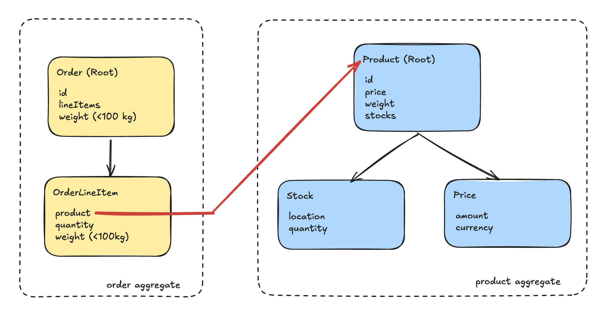
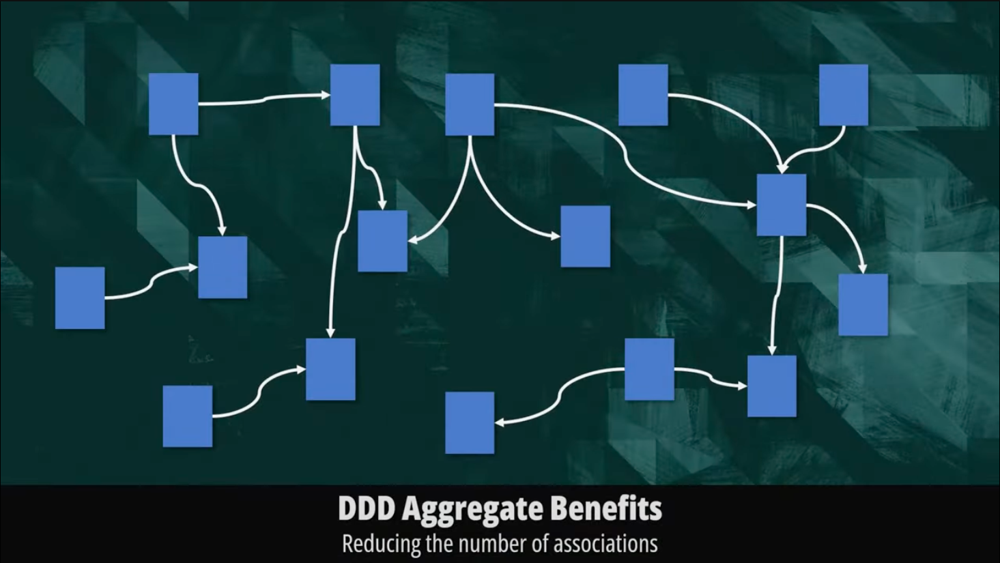

# Domain-Driven Design в Node.js

**Автор:** Heorhii Huziuk ‹[huziukwork@gmail.com](mailto:huziukwork@gmail.com)›
*Node.js Developer (Software Engineer / Backend Developer at FarmFusion)*

> **Передумови:**
> На створення цього артикулу мене підштовхнула нерозкритість теми проєктно-орієнтованого проєктування в Node.js. Є дужа багато індивідуальних підходів, які є непопулярними: кожен автор приносить щось своє і часто вони суперечать одне одному. Хоча є загальний концепт DDD, але не всі його практики є потрібними для розробки саме в умовах Node.js, ситуація схожа до патернів `Gang Of Four`, опис яких має лише дотичний стосунок до світу JavaScript-розробки. Бажаю Вам приємного читання і щиро запрошую до редакції чи дискусію:)

---

### Зміст

1.  [**Domain**](#domain)
    *   1.1 [Entities](#entities)
    *   1.2 [Value Objects](#value-objects)
    *   1.3 [Repositories (Інтерфейси)](#repositories-інтерфейси)
    *   1.4 [Aggregates (Агрегатори)](#aggregates-агрегатори)
    *   1.5 [Factories (Фабрики)](#factories-фабрики)
2.  [**Application**](#application)
    *   2.1 [Services](#services)
    *   2.2 [Application DTOs](#application-dtos)
    *   2.3 [Структура (Application)](#структура-application)
3.  [**Infrastructure**](#infrastructure)
    *   3.1 [Database](#database)
        *   3.1.1 [Маппери](#маппери)
    *   3.2 [Repositories (Реалізації)](#repositories-реалізації)
    *   3.3 [Структура (Infrastructure)](#структура-infrastructure)
4.  [**Presentation**](#presentation)
    *   4.1 [Controllers / Routes](#controllers--routes)
    *   4.2 [DTOs (Presentation)](#dtos-presentation)
    *   4.3 [Структура (Presentation)](#структура-presentation)
5.  [**Резюме**](#резюме)
6.  [**Посилання**](#посилання)

---

### Domain
> Domain прошарок відповідає за бізнес-логіку. Що таке бізнес логіка? - Це набір правил, за якими працює застосунок: перелік полів, правила валідації, тощо.

#### Entities
> В Сутностях описуються поля і обʼєкти застосунку. Обʼєкти в сенсі: у нас є користувач - нам треба зробити для нього сутність, є Тариф - треба зробити сутність для нього. Сутність - це як таблиця в базі даних, вона має певний набір полей: базовим є ID, імʼя, прізвище, enum з ролями, коли запис був створений і так далі.

Important to notice: 
    * Сутність має робити інкапсуляцію поведінки чи інваріантів(private а не public).
    * Сутність не перевіряє стан, не перевіряє формат email чи валідність телефону.
    * Сутність має містити value-objects, якщо в нас є комплексні дані: телефон, емейл, час...


Ось приклад того, як можна реалізувати сутність для користувача:
```ts
import { Email } from '../value-objects/Email'; // тут використаний VO, він буде розглянутий в наступному розділі

export class User {
    private readonly id: string;
    private name: string;
    private email: Email;
    private isActive: boolean;

    constructor(id: string, name: string, email: Email, isActive: boolean){
      this.id = id;
      this.name = name;
      this.email = email;
      this.isActive = isActive;
    }

    getEmail(): Email {
      return this.email;
    }

    changeEmail(newEmail: Email): void {
      this.email = newEmail;
    }

    activate(): void {
      this.isActive = true;
    }

    deactivate() {
      this.isActive = false;
    }

    getName(): string{
      return this.name;
    }

    toJson() {
      return {
        id: this.id,
        name: this.name,
        email: this.email.getValue(),
      }
  }
}
```

ось приклад використання у прикладному сервісі:
```ts
function registerUser(name: string, rawEmail: string): User {
  const email = new Email(rawEmail); // Value Object: інкапсулює валідацію
  const user = new User(uuidv4(), name, email, false);
  return user;
}

// уявімо, що це прийшло з сервера: 'Olena', 'olena@example.com'
const user = registerUser('Olena', 'olena@example.com');
```

#### Value-Objects

> Наступною частиною доменного прошарку є Value-Objects - це фактично частина, яка реалізує доступ до більш комплексних полів: Password, Email, PhoneNumber. де нам потрібно робити певні перевірки чи валідацію на прописані нами бізнес-правила.

Основні властивості, які визначають відмінність Value-Objects:
 * інкапсулює значення
 * гарантує їхню валідність згідно з бізнес-правилами
 * не має ідентичності(на відміну від Entity)
 * порівнюється за значенням, а не за ідентифікатором

```ts
// email.vo.ts
export class Email {
  private readonly value: string;

  constructor(value: string) {
    if (!/^[^\s@]+@[^\s@]+\.[^\s@]+$/.test(value)) {
      throw new Error('Invalid email');
    }
    this.value = value;
  }

  getValue(): string {
    return this.value;
  }
}
```

```ts
// password.vo.ts
import * as bcrypt from 'bcrypt';

export class Password {
  private readonly hashed: string;

  private constructor(hashed: string) {
    this.hashed = hashed;
  }

  static async create(raw: string): Promise<Password> {
    if (raw.length < 8) throw new Error('Password too short');
    const hashed = await bcrypt.hash(raw, 10);
    return new Password(hashed);
  }

  static fromHashed(hashed: string): Password {
    return new Password(hashed);
  }

  async compare(raw: string): Promise<boolean> {
    return bcrypt.compare(raw, this.hashed);
  }

  getHashed(): string {
    return this.hashed;
  }
}
```

Приклад використання у Entity:

```ts
import { Email } from '../value-objects/email.vo';
import { Password } from '../value-objects/password.vo';

export class User {
  constructor(
    private readonly id: string,
    private name: string,
    private surname: string,
    private email: Email,
    private phone: string | null,
    private password: Password,
    private isActive: boolean,
    private readonly createdAt: Date,
  ) {}

  getId(): string { return this.id; }
  getEmail(): string { return this.email.getValue(); }
  getHashedPassword(): string { return this.password.getHashed(); }

  activate() { this.isActive = true; }
  deactivate() { this.isActive = false; }

  async comparePassword(raw: string): Promise<boolean> {
    return this.password.compare(raw);
  }

  toPrimitives() {
    return {
      id: this.id,
      name: this.name,
      surname: this.surname,
      email: this.email.getValue(),
      phone: this.phone,
      password: this.password.getHashed(),
      isActive: this.isActive,
      createdAt: this.createdAt
    };
  }
}
```

Ось інший приклад використання:

```ts
// money.vo.ts
export class Money {
  private readonly amount: number;
  private readonly currency: string;

  constructor(amount: number, currency: string) {
    if (amount < 0) throw new Error('Amount cannot be negative');

    const allowedCurrencies = ['USD', 'EUR', 'UAH'];
    if (!allowedCurrencies.includes(currency)) {
      throw new Error(`Unsupported currency: ${currency}`);
    }

    this.amount = amount;
    this.currency = currency;
  }

  getAmount(): number {
    return this.amount;
  }

  getCurrency(): string {
    return this.currency;
  }

  add(other: Money): Money {
    if (this.currency !== other.currency) throw new Error('Currency mismatch');
    return new Money(this.amount + other.amount, this.currency);
  }

  subtract(other: Money): Money {
    if (this.currency !== other.currency) throw new Error('Currency mismatch');
    const result = this.amount - other.amount;
    if (result < 0) throw new Error('Resulting amount cannot be negative');
    return new Money(result, this.currency);
  }

  equals(other: Money): boolean {
    return this.amount === other.amount && this.currency === other.currency;
  }

  toString(): string {
    return `${this.amount.toFixed(2)} ${this.currency}`;
  }
}
```

І приклад використання в доменній сутності та репозиторії:

Сутність:
```ts
// src/domain/entities/invoice.entity.ts
import { Money } from '../value-objects/money.vo';
import { v4 as uuidv4 } from 'uuid';

export class Invoice {
  private readonly id: string;
  private readonly customerId: string;
  private total: Money;
  private isPaid: boolean = false;

  constructor(customerId: string, total: Money, id?: string) {
    this.id = id ?? uuidv4();
    this.customerId = customerId;
    this.total = total;
  }

  getId(): string {
    return this.id;
  }

  getTotal(): Money {
    return this.total;
  }

  markAsPaid(): void {
    this.isPaid = true;
  }

  applyDiscount(discount: Money): void {
    this.total = this.total.subtract(discount);
  }

  toJSON() {
    return {
      id: this.id,
      customerId: this.customerId,
      total: this.total.toString(),
      isPaid: this.isPaid,
    };
  }
}
```

Невеличка ORM-сутність:
```ts
// src/infrastructure/database/invoice.orm-entity.ts
export class InvoiceOrmEntity {
  id: string;
  customerId: string;
  amount: number;
  currency: string;
  isPaid: boolean;
}
```

А ось і сам репозиторій:
```ts
// src/infrastructure/repositories/invoice.repository.ts
import { InvoiceOrmEntity } from '../database/invoice.orm-entity';
import { Invoice } from '../../domain/entities/invoice.entity';
import { Money } from '../../domain/value-objects/money.vo';

export class InvoiceRepository {
  private db: InvoiceOrmEntity[] = []; // умовна БД в пам’яті

  async save(invoice: Invoice): Promise<void> {
    const record: InvoiceOrmEntity = {
      id: invoice.getId(),
      customerId: invoice['customerId'],
      amount: invoice.getTotal().getAmount(),
      currency: invoice.getTotal().getCurrency(),
      isPaid: invoice['isPaid'],
    };
    this.db.push(record);
  }

  async findById(id: string): Promise<Invoice | null> {
    const found = this.db.find(i => i.id === id);
    if (!found) return null;

    return new Invoice(
      found.customerId,
      new Money(found.amount, found.currency),
      found.id,
    );
  }
}
```

Сервіс: 
```ts
// src/application/invoice.service.ts
import { Money } from '../domain/value-objects/money.vo';
import { Invoice } from '../domain/entities/invoice.entity';
import { InvoiceRepository } from '../infrastructure/repositories/invoice.repository';

export class InvoiceService {
  constructor(private readonly repo: InvoiceRepository) {}

  async createInvoice(customerId: string, rawAmount: number, currency: string): Promise<Invoice> {
    const total = new Money(rawAmount, currency);
    const invoice = new Invoice(customerId, total);
    await this.repo.save(invoice);
    return invoice;
  }

  async applyDiscount(invoiceId: string, discountValue: number): Promise<Invoice> {
    const invoice = await this.repo.findById(invoiceId);
    if (!invoice) throw new Error('Invoice not found');

    const discount = new Money(discountValue, invoice.getTotal().getCurrency());
    invoice.applyDiscount(discount);
    await this.repo.save(invoice);
    return invoice;
  }
}
```

#### **Repositories (Інтерфейси)**
> В `Domain` ми можемо описати інтерфейси, які в подальшому ми зможемо імплементувати в `Infrastructure` 

Ось невеличкий приклад, який ми потім будемо реалізовувати в `Infrastructure`

```ts
// domain/repositories/user.repository.interface.ts
import { User } from "../../domain/entities/user.entity";

export const USER_REPOSITORY = "USER_REPOSITORY";

export interface IUserRepository {
  create(user: User): Promise<User>;
  findById(userId: string): Promise<User | null>;
  findByEmail(email: string): Promise<User | null>;
  findAll(): Promise<User[]>;
  update(userId: string, user: Partial<User>): Promise<User>;
  delete(userId: string): Promise<void>;
}

```

#### Aggregates (Агрегатори)
> Агрегатори - це сукупність взаємопов’язаних об’єктів, які розглядаються системою як одна цілісність для цілей оновлення та збереження. 

##### **Основні поняття**
1. **Aggregate Root (Корінь агрегації)**
    - є єдиною «вхідною точкою» для взаємодії з агрегатом.
    - забезпечує консистентність усіх об’єктів агрегації.
    - тільки корінь агрегації зберігається в репозиторії, а внутрішні об’єкти змінюються через методи кореня.
2. **Bounded Context**
    - агрегати живуть у межах певного контексту.
    - в одному контексті корінь одного агрегату не звертається до внутрішніх об’єктів іншого — взаємодія через ідентифікатори чи доменні події.
3. **Інваріанти агрегату**
    - правила та умови, які завжди мають виконуватися для стану всередині агрегату.

Ось схема, на якій зображений приклад взаємодії двох агрегатів:



*Schema 1: Схема взаємодії агрегатів. Джерело: [Domain-Driven Aggregates Explained | Why you should use them](https://youtu.be/SvnsOX4oVVo?si=fOr35OPCDUUFNWQn)*

##### **Чому потрібні агрегати?**
* **Консистентність:** забезпечують, що всі частини агрегату завжди перебувають у коректному стані після будь-якої операції.
* **Транзакційна межа:** всі зміни в агрегаті комітяться як одна транзакція.
* **Ізоляція:** захищають внутрішню структуру (інкапсуляція), дозволяючи звертатися лише через корінь.
* **Чіткість моделі:** кластери об’єктів логічно об’єднані в одне ціле за бізнес-контекстом.

Ось схема, яка наглядно показує, яку павутину реляцій ми отримуємо, не створюючи агрегатів:


*Schema 2: Відсутність агрегатів в коді. Джерело: [Domain-Driven Aggregates Explained | Why you should use them](https://youtu.be/SvnsOX4oVVo?si=fOr35OPCDUUFNWQn)*

Ось схема, яка демонструє чіткість, яку дає нам використання агрегатів:


*Schema 3: Код сепарований на агрегати. Джерело: [Domain-Driven Aggregates Explained | Why you should use them](https://youtu.be/SvnsOX4oVVo?si=fOr35OPCDUUFNWQn)*

##### **Використання агрегатів в коді**

Приклад агрегату `Product`, де ми імплементуємо `Stock` як сутність, а Price - як `Value Object`

```ts
// Value Object: Price
export class Price {
  private readonly _amount: number;
  private readonly _currency: string;

  constructor(amount: number, currency: string) {
    if (amount < 0) {
      throw new Error("Amount cannot be a negative number");
    }
    if (!currency || currency.trim().length !== 3) {
      throw new Error("Currency must be a valid 3-letter code");
    }
    this._amount = amount;
    this._currency = currency.toUpperCase();
  }

  get amount(): number {
    return this._amount;
  }

  get currency(): string {
    return this._currency;
  }

  toString(): string {
    return `${this._amount} ${this._currency}`;
  }
}

// Value Object: Location
export class Location {
  private readonly _longitude: number;
  private readonly _latitude: number;

  constructor(longitude: number, latitude: number) {
    if (longitude < -180 || longitude > 180) {
      throw new Error("Longitude must be between -180 and 180");
    }
    if (latitude < -90 || latitude > 90) {
      throw new Error("Latitude must be between -90 and 90");
    }
    this._longitude = longitude;
    this._latitude = latitude;
  }

  get longitude(): number {
    return this._longitude;
  }

  get latitude(): number {
    return this._latitude;
  }

  toString(): string {
    return `(${this._latitude}, ${this._longitude})`;
  }
}

// Entity: Stock (частина агрегату Product)
export class Stock {
  private _location: Location;
  private _quantity: number;

  constructor(location: Location, quantity: number) {
    if (quantity < 0) {
      throw new Error("Quantity cannot be negative");
    }
    this._location = location;
    this._quantity = quantity;
  }

  get location(): Location {
    return this._location;
  }

  get quantity(): number {
    return this._quantity;
  }

  increase(amount: number): void {
    if (amount <= 0) {
      throw new Error("Increase amount must be positive");
    }
    this._quantity += amount;
  }

  decrease(amount: number): void {
    if (amount <= 0 || amount > this._quantity) {
      throw new Error("Invalid decrease amount");
    }
    this._quantity -= amount;
  }
}

// Aggregate Root: Product
export class Product {
  private readonly _id: string;
  private readonly _price: Price;
  private readonly _weight: number;
  private readonly _stocks: Stock[];

  constructor(id: string, price: Price, weight: number, stocks: Stock[]) {
    if (!id || id.trim() === "") {
      throw new Error("Product id must be provided");
    }
    if (weight <= 0) {
      throw new Error("Weight must be a positive number");
    }
    if (!stocks || stocks.length === 0) {
      throw new Error("At least one stock location is required");
    }

    this._id = id;
    this._price = price;
    this._weight = weight;
    this._stocks = stocks;
  }

  get id(): string {
    return this._id;
  }

  get price(): Price {
    return this._price;
  }

  get weight(): number {
    return this._weight;
  }

  get stocks(): ReadonlyArray<Stock> {
    return this._stocks;
  }

  totalQuantity(): number {
    return this._stocks.reduce((sum, s) => sum + s.quantity, 0);
  }

  findStockByLocation(loc: Location): Stock | undefined {
    return this._stocks.find(
      s =>
        s.location.latitude === loc.latitude &&
        s.location.longitude === loc.longitude
    );
  }

  addStock(location: Location, quantity: number): void {
    if (this.findStockByLocation(location)) {
      throw new Error("Stock already exists for this location");
    }
    if (quantity < 0) {
      throw new Error("Quantity cannot be negative");
    }
    this._stocks.push(new Stock(location, quantity));
  }

  transferStock(from: Location, to: Location, quantity: number): void {
    const src = this.findStockByLocation(from);
    const dst = this.findStockByLocation(to);

    if (!src) throw new Error("Source location not found");
    if (!dst) throw new Error("Destination location not found");

    src.decrease(quantity);
    dst.increase(quantity);
  }
}
```

А ось приклад імплементації агрегату `Order`:
```ts
import { Product } from "./Product"; 

// Entity inside Order aggregate: OrderLineItem
export class OrderLineItem {
  private readonly _product: Product;
  private _quantity: number;

  constructor(product: Product, quantity: number) {
    if (quantity <= 0) {
      throw new Error("Quantity must be greater than zero");
    }
    this._product = product;
    this._quantity = quantity;
    this.ensureWeightLimit();
  } 

  get product(): Product {
    return this._product;
  }

  get quantity(): number {
    return this._quantity;
  }

  get weight(): number {
    return this._product.weight * this._quantity;
  }
  
  changeQuantity(newQuantity: number): void {
    if (newQuantity <= 0) {
      throw new Error("Quantity must be greater than zero");
    }
    this._quantity = newQuantity;
    this.ensureWeightLimit();
  }

  private ensureWeightLimit(): void {
    if (this.weight > 100) {
      throw new Error(
        `OrderLineItem weight (${this.weight}kg) exceeds 100kg limit`
      );
    }
  }
}

// Aggregate Root: Order
export class Order {
  private readonly _id: string;
  private readonly _lineItems: OrderLineItem[] = [];

  constructor(id: string, lineItems: OrderLineItem[] = []) {
    if (!id || id.trim() === "") {
      throw new Error("Order id must be provided");
    }
    this._id = id;
    lineItems.forEach((li) => this.addLineItem(li));
    this.ensureTotalWeightLimit();
  }

  get id(): string {
    return this._id;
  }

  get lineItems(): ReadonlyArray<OrderLineItem> {
    return this._lineItems;
  }

  get totalWeight(): number {
    return this._lineItems.reduce((sum, li) => sum + li.weight, 0);
  }

  addLineItem(item: OrderLineItem): void {
    if (this._lineItems.some((li) => li.product.id === item.product.id)) {
      throw new Error("Order already contains this product");
    }
    this._lineItems.push(item);
    this.ensureTotalWeightLimit();
  }

  removeLineItemByProductId(productId: string): void {
    const idx = this._lineItems.findIndex((li) => li.product.id === productId);
    if (idx === -1) {
      throw new Error("LineItem not found for productId " + productId);
    }
    this._lineItems.splice(idx, 1);
  }

  changeLineItemQuantity(productId: string, newQuantity: number): void {
    const li = this._lineItems.find((li) => li.product.id === productId);
    if (!li) {
      throw new Error("LineItem not found for productId " + productId);
    }
    li.changeQuantity(newQuantity);
    this.ensureTotalWeightLimit();
  }

  private ensureTotalWeightLimit(): void {
    if (this.totalWeight > 100) {
      throw new Error(
        `Order total weight (${this.totalWeight}kg) exceeds 100kg limit`
      );
    }
  }
}
```

#### Factories (Фабрики)
> У DDD також виокремлюють фабрики - спеціалізовані об’єкти або методи, які відповідають за створення складних доменних об’єктів у правильному консистентному стані. Основна ідея в тому, щоб винести з конструктора усю «важку» логіку збирання й валідації внутрішніх інваріантів у окремий клас або метод, а не роздувати самі сутності.

Для імплементації фабрики використовують два підходи:

1. **Static factory method**

Метод всередині самого агрегату/сутності:

```ts
export class Order {
  private constructor(/* ... */) { /* ... */ }

  public static createNew(
    customerId: string,
    items: OrderLineItem[],
  ): Order {
    // тут перевірки, валідація, встановлення дефолтів
    if (items.length === 0) {
      throw new Error("Order must have at least one item");
    }
    const order = new Order(/* … */);
    return order;
  }
}

// Виклик:
const order = Order.createNew(customerId, items);
```

2. **Dedicated factory class**

Окремий сервіс-фабрика:

```ts
export class OrderFactory {
  constructor(
    private readonly productRepo: ProductRepository,
    private readonly stockRepo: StockRepository
  ) {}

  public async createOrder(
    customerId: string,
    dtoItems: { productId: string; qty: number }[]
  ): Promise<Order> {
    // завантажуємо продукти, перевіряємо запаси, формуємо OrderLineItem…
    const items: OrderLineItem[] = [];
    for (const dto of dtoItems) {
      const product = await this.productRepo.getById(dto.productId);
      items.push(new OrderLineItem(product, dto.qty));
    }
    return Order.createNew(customerId, items);
  }
}

// Виклик із сервісу чи контролера:
const order = await orderFactory.createOrder(userId, payload.items);
```

##### Коли використовувати
* Коли конструктор агрегату/сутності перестає бути “тонким” і набирає багато коду валідації.
* Коли потрібно ін’єктити зовнішні сервіси або репозиторії під час створення.
* Коли хочеться чітко розділити обов’язки: фабрика — за створення, агрегат — за бізнес-логіку після створення.


---

### **Application**
> Цей прошарок призначений для того, щоб реалізувати use-case, а саме для оркестрації взаємодії бізнес логіки з Domain(Entities, Value Objects, Aggregates) та
зовнішнім світом(інтерфейс користувача, API, інфраструктура, тощо).

#### **Services**
Application Services - це сервіси, які:
    * не містять бізнес-логіки
    * викликають доменні об’єкти, агрегати, репозиторії
    * керують транзакціями, якщо потрібно
    * реалізують use cases - виконання бізнес-сценарію, наприклад реєстрацію чи знаходження користувача по id, не реалізовуючи бізнес-логіку, а лише викликаючи доменні обʼєкти, які реалізують цю логіку

**Приклад сервісу:**
```ts
// application/services/register-user.service.ts
export class RegisterUserService {
  constructor(
    private readonly userRepo: IUserRepository,
    private readonly logger: ILogger,
  ) {}

  async execute(request: RegisterUserRequest): Promise<RegisterUserResponse> {
    this.logger.log(`Registering user: ${request.email}`, 'RegisterUserService');

    const email = new Email(request.email); // VO
    const user = new User(uuidv4(), request.name, email, false); // Entity

    await this.userRepo.save(user);

    this.logger.log(`User registered: ${user.getEmail().getValue()}`, 'RegisterUserService');

    return new RegisterUserResponse(user.getId(), user.getEmail().getValue());
  }
}
```


#### **Application DTOs**
Data Transfer Objects:
 * описують вхідні та вихідні дані для сервісів
 * адаптують дані до/з домену
 * використовуються для ізоляції від зовнішніх моделей(ORM-сутностей чи HTTP-запитів)

**Приклад DTO:**
```ts
// dto/register-user.request.ts
export class RegisterUserRequest {
  constructor(public name: string, public email: string) {}
}

// dto/register-user.response.ts
export class RegisterUserResponse {
  constructor(public id: string, public email: string) {}
}
```

Взаємодія `RegisterUserService` в контролері буде виглядати приблизно так:
```ts
@Post('/register')
async register(@Body() body: RegisterUserDto) { // наше перше DTO
  const req = new RegisterUserRequest(body.name, body.email);
  const res = await this.registerUserService.execute(req);
  return res;
}
```

#### **Структура**
Ось приклад структури застосунку для Application прошарку:
```text
src/
├── application/
│   ├── services/
│   │   └── register-user.service.ts
│   ├── dto/
│   │   ├── register-user.request.ts
│   │   └── register-user.response.ts
```

---

### **Infrastructure**
> Це шар, який агрегує всю роботу зі сторонніми частинами, такими як: бази даних, стороннє API, файлова система, кешування, черги, тощо.


#### **Database**
> Ось частина коду, яка відповідає за інтеграцію підключення з базою даних. Для реалізації такого 


##### **Маппери** 

> Маппери - це технічний міст між Infrastructure <—> Domain <—> DTO, вони допомагають нам не змішувати код і не порушувати `Single Responsibility Principle`.Основна причина використання мапперів полягає в тому, що доменна модель і ORM-сутність (або DTO) можуть мати різну структуру, обов’язки або рівень абстракції. Саме маппер відповідає за чисте та контрольоване перетворення між цими шарами, зберігаючи чистоту архітектури та ізоляцію домену від технічних деталей. Наприклад, у доменній моделі Email є Value Object із валідацією, а в базі це звичайний рядок — маппер інкапсулює логіку перетворення між ними.

**Приклад класичного маппера:**

```ts
// user.mapper.ts
import { User } from '../../domain/entities/user.entity';
import { Email } from '../../domain/value-objects/email.vo';
import { Password } from '../../domain/value-objects/password.vo';
import { UserOrmEntity } from '../database/user.orm-entity';

export class UserMapper {
  static async toDomain(entity: UserOrmEntity): Promise<User> {
    return new User(
      entity.userId,
      entity.name,
      entity.surname,
      new Email(entity.email),
      entity.phone,
      Password.fromHashed(entity.password),
      entity.isActive,
      entity.createdAt,
    );
  }

  static toOrm(user: User): UserOrmEntity {
    const raw = user.toPrimitives();
    const orm = new UserOrmEntity();
    orm.userId = raw.id;
    orm.name = raw.name;
    orm.surname = raw.surname;
    orm.email = raw.email;
    orm.phone = raw.phone;
    orm.password = raw.password;
    orm.isActive = raw.isActive;
    orm.createdAt = raw.createdAt;
    return orm;
  }
}
```

#### **Repositories (Реалізації)**
> В цій частині реалізуються репозиторії, прописані в домені, звісно це не stricte, але зачасту робиться саме так.

```ts
// user.repository.ts
import { Injectable } from '@nestjs/common';
import { Repository } from 'typeorm';
import { InjectRepository } from '@nestjs/typeorm';
import { IUserRepository } from './user.repository.interface';
import { User } from '../../domain/entities/user.entity';
import { UserOrmEntity } from '../database/user.orm-entity';
import { UserMapper } from './user.mapper';

@Injectable()
export class UserRepository implements IUserRepository {
  constructor(
    @InjectRepository(UserOrmEntity)
    private readonly repository: Repository<UserOrmEntity>
  ) {}

  async create(user: User): Promise<User> {
    const saved = await this.repository.save(UserMapper.toOrm(user));
    return await UserMapper.toDomain(saved);
  }

  async findById(userId: string): Promise<User | null> {
    const entity = await this.repository.findOne({ where: { userId } });
    return entity ? await UserMapper.toDomain(entity) : null;
  }

  async findByEmail(email: string): Promise<User | null> {
    const entity = await this.repository.findOne({ where: { email } });
    return entity ? await UserMapper.toDomain(entity) : null;
  }

  async delete(userId: string): Promise<void> {
    await this.repository.delete({ userId });
  }

  async update(user: User): Promise<User> {
    const updated = await this.repository.save(UserMapper.toOrm(user));
    return await UserMapper.toDomain(updated);
  }
}
```

#### **Структура (Application)**
```text
src/
└── infrastructure/
    ├── config/
    │   ├── database.config.ts        # налаштування підключення до БД
    │   ├── cache.config.ts           # налаштування кешу (Redis)
    │   └── logger.config.ts          # налаштування логування (winston/pino)
    │
    ├── database/
    │   ├── entities/                 # ORM-схеми
    │       ├── user.orm-entity.ts
    │       ├── order.orm-entity.ts
    │       └── ...  
    │
    ├── repositories/                 # реалізації інтерфейсів репозиторіїв
    │   ├── user.repository.ts        # реалізація IUserRepository через TypeORM
    │   ├── order.repository.ts       # реалізація IOrderRepository
    │   └── ...
    │
    ├── services/                     # технічні сервіси (адаптери)
    │   ├── email/
    │   │   ├── email.service.ts      # implements IEmailService (SMTP, SendGrid тощо)
    │   │   └── email.module.ts
    │   ├── payment/
    │   │   ├── stripe.service.ts     # implements IPaymentGateway
    │   │   └── payment.module.ts
    │   ├── cache/
    │   │   ├── cache.service.ts      # Redis adapter
    │   │   └── cache.module.ts
    │   └── ...
    │
    ├── clients/                      # клієнти до зовнішніх API/сервісів
    │   ├── sms.client.ts             # Twilio, Vonage тощо
    │   ├── geolocation.client.ts     # Google Maps API
    │   └── ...
    │
    ├── messaging/                    # черги та події
        ├── kafka.producer.ts
        ├── rabbitmq.module.ts
        └── subscribers/              # обробники вхідних подій
            └── order-created.subscriber.ts
```

---

### **Presentation**
> Прошарок `Presentation` відповідає за взаємодію з зовіншнім світом. Це реалізується за допомогою HTTP, WebSocket, GraphQL тощо. Його завдання — перетворити зовнішні запити в DTO, викликати відповідні сервіси прикладного шару, і повернути клієнту DTO-відповідь або відповідний статус.

#### **Controllers / Routes**

##### Загальна ідея(ванільна Node.js / Express-style): 
  - Routes — просто реєстрація шляхів (URL + HTTP-метод) і middleware.
  - Controllers (Handlers) — функції, що:
    1. Приймають `req`, `res`, `next` (Express/Koa/Fastify).
    2. Маплять тіло запиту в Application DTO (Request DTO).
    3. Викликають потрібний Application Service.
    4. Маплять результат у Response DTO і віддають `res.json(...)` або `res.status(...).send(...)`.
    5. Обробляють помилки (через `try/catch` + `next(err)` або через централізований error-handler).

* **Приклад 1:**

```ts
// express приклад
import { Router, Request, Response, NextFunction } from 'express';
import { RegisterUserService } from '../application/services/register-user.service';
import { RegisterUserRequest } from '../application/dto/register-user.request';
import { RegisterUserResponse } from '../application/dto/register-user.response';

const router = Router();
const service = new RegisterUserService(userRepo);

router.post('/users', async (req: Request, res: Response, next: NextFunction) => {
  try {
    const dto = new RegisterUserRequest(req.body.name, req.body.email);
    const result = await service.execute(dto);
    const responseDto = new RegisterUserResponse(result.id, result.email);
    res.status(201).json(responseDto);
  } catch (err) {
    next(err);
  }
});

export default router;
```

* **Приклад 2(більш практичний):**

Тут я використав поділ на контролер і на роутер, оскільки це зменшує нам зачіплення і дозволяє додати більше логіки в роутер(мідлвейри) без додаткового когнітивного навантаження.

* **Роутер:**
```ts
// fastify приклад
export async function userRoutes(fastify: FastifyInstance) {
  fastify.post(
    "/users",
    { preHandler: [authorize([UserRole.ADMIN]), isAdmin()] },
    addUser,
  );

  fastify.get(
    "/users",
    { preHandler: [authorize([UserRole.ADMIN]), isAdmin()] },
    getAllUsers,
  );
  //...
}
```

* **Контролер:**
```ts
export const addUser = async (request: FastifyRequest, reply: FastifyReply) => {
  try {
    const userDto = CreateUserDTOSchema.parse(request.body);
    const newUser = await UserService.addUser(userDto);
    reply.status(201).send(newUser);
  } catch (error) {
    if (error instanceof z.ZodError) {
      reply
        .code(400)
        .send({ message: "Validation error", errors: error.errors });
    } else {
      logger.error(`Error creating user: ${error}`);
      reply.status(500).send({ message: "Error creating user" });
    }
  }
};

export const getAllUsers = async (_: FastifyRequest, reply: FastifyReply) => {
  try {
    const users = await UserService.getAll();
    reply.status(200).send(users);
  } catch (error) {
    logger.error(`Error getting all users: ${error}`);
    if (error instanceof CustomError) {
      reply.status(error.statusCode).send({ message: error.message });
    } else {
      reply.status(500).send({ message: "Error during get all users" });
    }
  }
};
```

##### Загальна ідея(NestJS): 
  - **Controllers** — класи з декораторами `@Controller()`, методами `@Get()`, `@Post()` тощо.
  - **Routes** — будуть згенеровані автоматично з цих декораторів.
  - **DI** — через constructor(private readonly svc: Service).

* **Приклад:**
```ts
// users.controller.ts
import { Controller, Post, Body } from '@nestjs/common';
import { RegisterUserService } from '../../application/services/register-user.service';
import { RegisterUserDto } from './dto/register-user.dto';

@Controller('users')
export class UsersController {
  constructor(private readonly registerSvc: RegisterUserService) {}

  @Post()
  async register(@Body() body: RegisterUserDto) {
    const result = await this.registerSvc.execute({
      name: body.name,
      email: body.email,
    });
    return { id: result.id, email: result.email };
  }
}
```

#### **DTOs (Presentation)**
В цьому прошарку DTO (Data Transfer Objects) варто поділити на два типи: 
* **Request DTO** — структура, яка точно описує, які дані приймаються з зовнішнього інтерфейсу.
  - Використовуються для валідації (наприклад, `Joi`, `class-validator`, `zod`).
  - Мінімізують “хардкод” полів у контролерах.

* **Response DTO** - структура, якою відповідаємо клієнту.
  - Може ховати “чутливі” поля (`password`, внутрішні ідентифікатори).
  - Дозволяє керувати форматом відповіді.

* **Приклад 1 (pure Node.js style):**
```ts
// express-fastify style
// application/dto/register-user.request.ts
export class RegisterUserRequest {
  constructor(
    public readonly name: string,
    public readonly email: string,
  ) {}
}

// application/dto/register-user.response.ts
export class RegisterUserResponse {
  constructor(
    public readonly id: string,
    public readonly email: string,
  ) {}
}
```

* **Приклад 2 (NestJS):**
```ts
//NestJS
import { IsString, IsEmail } from 'class-validator';

export class RegisterUserDto {
  @IsString() name: string;
  @IsEmail() email: string;
}
```

#### **Структура (Presentation)**
```text
src/
└── interfaces/                   # або presentation/
    ├── http/                     # HTTP-API
    │   ├── controllers/          # NestJS: controller-класи
    │   │   └── users.controller.ts
    │   ├── routes/               # Express/Koa/Fastify роутери
    │   │   └── users.routes.ts
    │   ├── dto/                  # HTTP DTO (вхідні/вихідні)
    │   │   ├── register-user.dto.ts
    │   │   └── ...
    │
    ├── graphql/                  # якщо є GraphQL
    │   ├── resolvers/
    │   └── schemas/
    │
    ├── cli/                      # якщо є командний інтерфейс
    │   └── commands/
    │
    └── websocket/                # якщо є WebSocket/Event
        └── gateways/
```

### Резюме:
Підсумовуючи, хочеться наголосити, що в контексті багатьох архітектурних стилів (`Clean Architecture`, `Hexagonal`, `Onion`, `DDD`) існує `“Dependency Rule”` (правило залежностей) формулюється так:
> **Код усередині одного шару не може залежати від коду зовнішнього шару.** Іншими словами, стрілки залежності завжди йдуть всередину, від менш стабільних/більш прикладних модулів до більш стабільних/більш абстрактних.

Якщо зобразити це наглядно, вийде щось таке:
`Presentation → Application → Domain ← Infrastructure`.

І ось коротенька табличка, яка підбиває підсумки для всіх розділів, описаних в статті:
| Шар (Layer)      | Основні обов'язки                                                                                                | Ключові компоненти                                                                                                                              |
|------------------|-------------------------------------------------------------------------------------------------------------------|-------------------------------------------------------------------------------------------------------------------------------------------------|
| **Domain**       | Визначення та інкапсуляція бізнес-логіки, правил предметної області, інваріантів та стану.                          | Сутності (Entities), Об'єкти-значення (Value Objects), Агрегати (Aggregates), Доменні сервіси (Domain Services), Інтерфейси репозиторіїв.        |
| **Application**  | Оркестрація сценаріїв використання (use cases), координація взаємодії між доменними об'єктами та інфраструктурою. | Сервіси додатку (Application Services), Команди (Commands), Запити (Queries), DTO додатку (Application DTOs для вхідних/вихідних даних сервісів). |
| **Infrastructure**| Реалізація взаємодії із зовнішніми системами (бази даних, сторонні API, файлова система, черги повідомлень, кеш).  | Реалізації репозиторіїв, ORM-сутності, Маппери (Mappers), Адаптери/Шлюзи (Adapters/Gateways) до зовнішніх сервісів, конфігурація, логери.     |
| **Presentation** | Взаємодія з користувачем або іншими клієнтськими системами (HTTP API, WebSocket, GraphQL, CLI).                     | Контролери/Маршрутизатори (Controllers/Routes), DTO представлення (Presentation DTOs для запитів/відповідей), Обробники подій, UI (якщо є).   |

Дотримання такого поділу на шари та чіткого визначення їхніх обов'язків допомагає будувати системи, які є:
- **Тестованими:** Бізнес-логіка в `Domain` ізольована і може тестуватися без залежності від UI чи БД.
- **Гнучкими:** Легше замінювати технології в `Infrastructure` (наприклад, БД) або способи взаємодії в Presentation без значного впливу на інші шари.
- **Зрозумілими:** Чітка структура полегшує розуміння коду та введення нових розробників у проєкт.
- **Масштабованими та Підтримуваними:** Логічний поділ спрощує розширення функціоналу та довгострокову підтримку системи.

---

### Посилання

* (Eric Evans - "Domain-Driven Design Tackling Complexity in the Heart of Software")[https://fabiofumarola.github.io/nosql/readingMaterial/Evans03.pdf]
* (Marco Lenzo - "Domain-Driven Aggregates Explained | Why you should use them")[https://youtu.be/SvnsOX4oVVo?si=cGBi1kU4jKDSb7Ar]